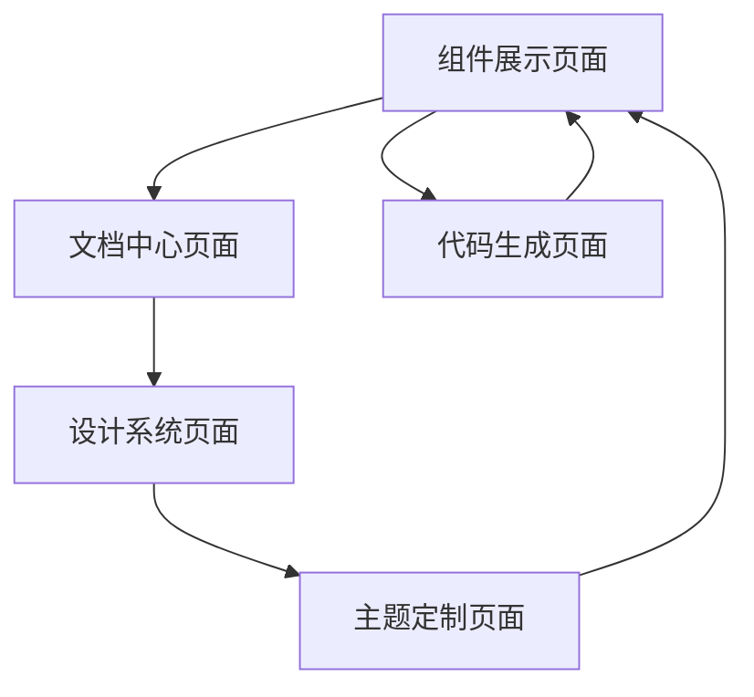

# AI组件库产品需求文档

## 1. 产品概述

本项目旨在开发一套专门为AI应用设计的现代化React组件库，采用Tailwind CSS + TypeScript + React + Vite技术栈。
该组件库将为AI开发者提供高质量、可复用的UI组件，简化AI应用的前端开发流程，提升开发效率和用户体验。
目标是成为AI领域最受欢迎的前端组件库，为AI应用提供统一的设计语言和交互标准。

## 2. 核心功能

### 2.1 用户角色

| 角色 | 使用方式 | 核心权限 |
|------|----------|----------|
| AI开发者 | NPM包安装使用 | 可使用所有组件、查看文档、定制主题 |
| 设计师 | 设计系统参考 | 可查看设计规范、组件样式、使用指南 |

### 2.2 功能模块

我们的AI组件库包含以下核心页面：
1. **组件展示页面**：组件预览、属性配置、代码示例
2. **文档中心页面**：安装指南、使用教程、API文档
3. **设计系统页面**：颜色规范、字体系统、间距标准
4. **主题定制页面**：主题切换、颜色配置、样式预览
5. **代码生成页面**：组件代码生成、配置导出、快速复制

### 2.3 页面详情

| 页面名称 | 模块名称 | 功能描述 |
|----------|----------|----------|
| 组件展示页面 | 组件预览区 | 实时展示组件效果，支持属性动态调整 |
| 组件展示页面 | 属性配置面板 | 提供组件属性配置界面，实时预览效果 |
| 组件展示页面 | 代码示例区 | 显示组件使用代码，支持复制和下载 |
| 文档中心页面 | 快速开始指南 | 提供安装、配置、基础使用教程 |
| 文档中心页面 | API文档 | 详细的组件API说明和参数列表 |
| 文档中心页面 | 最佳实践 | 组件使用建议和常见问题解答 |
| 设计系统页面 | 颜色系统 | 展示主色调、辅助色、状态色规范 |
| 设计系统页面 | 字体规范 | 字体大小、行高、字重标准 |
| 设计系统页面 | 间距系统 | 内边距、外边距、组件间距规范 |
| 主题定制页面 | 主题切换器 | 支持亮色/暗色主题切换 |
| 主题定制页面 | 颜色配置器 | 自定义主题颜色配置 |
| 主题定制页面 | 预览区域 | 实时预览主题效果 |
| 代码生成页面 | 组件选择器 | 选择需要的组件和配置 |
| 代码生成页面 | 代码生成器 | 生成可用的React组件代码 |
| 代码生成页面 | 导出工具 | 支持代码复制、文件下载 |

## 3. 核心流程

**开发者使用流程：**
用户访问组件库官网 → 浏览组件展示页面了解可用组件 → 查看文档中心学习使用方法 → 通过NPM安装组件库 → 在项目中导入和使用组件 → 根据需要定制主题样式

**设计师参考流程：**
用户访问设计系统页面 → 了解颜色、字体、间距规范 → 参考组件设计标准 → 在设计工具中应用设计系统

## 4. 用户界面设计

### 4.1 设计风格

- **主色调**：深蓝色 (#1e40af)、科技蓝 (#3b82f6)
- **辅助色**：灰色系 (#64748b, #94a3b8, #cbd5e1)
- **状态色**：成功绿 (#10b981)、警告橙 (#f59e0b)、错误红 (#ef4444)
- **按钮样式**：圆角设计，渐变背景，悬停动效
- **字体**：Inter字体，标题16-24px，正文14-16px
- **布局风格**：卡片式布局，顶部导航，侧边栏分类
- **图标风格**：线性图标，统一风格，支持多种尺寸

### 4.2 页面设计概览

| 页面名称 | 模块名称 | UI元素 |
|----------|----------|--------|
| 组件展示页面 | 组件预览区 | 白色卡片背景，阴影效果，圆角边框，响应式布局 |
| 组件展示页面 | 属性配置面板 | 侧边栏布局，表单控件，实时预览连接 |
| 文档中心页面 | 导航菜单 | 树形结构，搜索功能，分类标签 |
| 设计系统页面 | 颜色展示 | 色块网格，色值显示，复制功能 |
| 主题定制页面 | 配置面板 | 滑块控件，颜色选择器，预设主题 |
| 代码生成页面 | 代码编辑器 | 语法高亮，行号显示，复制按钮 |

### 4.3 响应式设计

产品采用移动优先的响应式设计，支持桌面端和移动端访问，针对触摸交互进行优化。